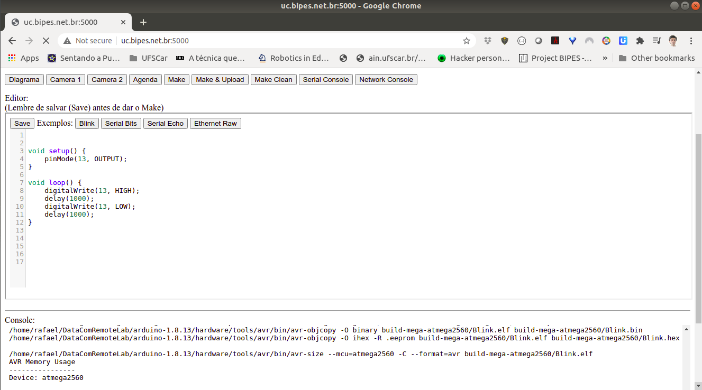

# RemoteMicrocontrollerLab
A set of PHP files, scripts and database to allow remote users to edit programs, upload code and access the serial port of real microcontrollers.

Features
- Fully web based solution
- Online web editor
- Examples
- Real time access to the device LEDs, surrounds using a webcam available with motion
- Usage control with scheduling / with / without authorization
- Real time access (full duplex) to the device's serial port using a web-base remote terminal (connected to the device's serial port)
- Transparent remote code upload using avrdude or esptool from the web-browser

Tested with Arduino and ESP8266 boards (Rafael Aroca)

Dependencies
- CodeMirror (https://github.com/codemirror/CodeMirror)
- LuxCal (https://www.luxsoft.eu/index.php?pge=dload)
- MySQL
- Apache + PHP
- Arduino makefile (https://github.com/sudar/Arduino-Makefile)
- Arduino IDE
- Motion (for webcam) (https://github.com/Motion-Project/motion)
- WebREPL HTML application (https://github.com/micropython/webrepl)
- WebREPL Serial to WebSocket server (https://github.com/rafaelaroca/SerialWebSocketServer)
- HexEditor (http://xem.github.io/hex)

Installation / dependencies
1. On a Linux machine, install Apache + MySQL + PHP and Apache+PHP+MySQL modules, if you still don't have it
2. Install luxcal (https://www.luxsoft.eu/index.php?pge=dload) on /var/www/html/agenda folder (tested with luxcal 479)
3. Configure luxcal database and SMTP. Test your calendar install and if approved events are senging email
4. Install and configure motion
5. 

Prof. Ricardo Menotti adapted it to work with FPGA devices, allowing synthesis, upload and test of FPGA devices remotely

TODO
- upload code
- screenshot
- photo
- better explain how it works
